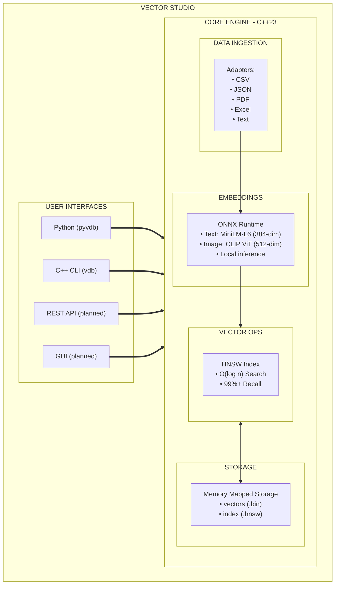

# Introduction

  

## ⬜️ HECKTOR

> Vector Studio

Meet Hecktor, the AI Vector Studio. This comprehensive guide covers everything from basic usage to advanced topics and API reference.

### INDEX

| #  | Document                                                                                                                | Description                                                       | Audience                   |
| -- | ----------------------------------------------------------------------------------------------------------------------- | ----------------------------------------------------------------- | -------------------------- |
| 01 | [**README**](https://github.com/amuzetnoM/hektor/blob/main/docs/.DOCS/01_README.md)                                     | This file - Introduction, documentation overview and quick start  | All users                  |
| 02 | [**GETTING\_STARTED**](02_installation.md)                                                                              | Installation, quick start, basic usage, CLI reference             | Beginners                  |
| 03 | [**USER\_GUIDE**](04_user_guide.md)                                                                                     | Complete user guide from installation to advanced usage           | All users                  |
| 04 | [**DATA\_FORMATS**](06_data_formats.md)                                                                                 | Supported data types, formats, and specifications                 | Data engineers, developers |
| 05 | [**DATA\_INGESTION**](07_data_ingestion.md)                                                                             | Data ingestion module with adapters (CSV, JSON, PDF, Excel, Text) | Data engineers             |
| 06 | [**ARCHITECTURE**](05_architecture.md)                                                                                  | System design, data flow, component diagrams                      | Architects, contributors   |
| 07 | [**API\_REFERENCE**](20_api_reference.md)                                                                               | Detailed API documentation for all classes and functions          | Developers                 |
| 08 | [**MODELS**](08_embeddings_models.md)                                                                                   | Model specifications, benchmarks, integration                     | ML practitioners           |
| 09 | [**MATH**](09_vector_operations.md)                                                                                     | Mathematical foundations, HNSW algorithm, distance metrics        | ML engineers               |
| 10 | [**AI\_TRAINING**](10_ai_training.md)                                                                                   | Training custom models, fine-tuning, contrastive learning         | AI researchers             |
| 11 | [**LOGGING**](15_logging_monitoring.md)                                                                                 | Comprehensive logging system with anomaly detection               | DevOps, developers         |
| 12 | [**USAGE\_EXAMPLES**](https://github.com/amuzetnoM/hektor/blob/main/docs/.DOCS/12_USAGE_EXAMPLES.md)                    | Code examples and common usage patterns                           | All developers             |
| 13 | [**DEPLOYMENT**](16_deployment.md)                                                                                      | Production deployment guide                                       | DevOps, architects         |
| 14 | [**REAL\_WORLD\_APPLICATIONS**](https://github.com/amuzetnoM/hektor/blob/main/docs/.DOCS/19_REAL_WORLD_APPLICATIONS.md) | Production use cases and benchmarks                               | Solution architects        |
| 15 | [**LLM\_ENGINE**](13_llm_engine.md)                                                                                     | **NEW** - Local text generation with llama.cpp                    | AI developers              |
| 16 | [**QUANTIZATION**](14_quantization.md)                                                                                  | **NEW** - Vector compression techniques (4-32x)                   | Performance engineers      |
| 17 | [**HTTP\_ADAPTER**](17_http_adapter.md)                                                                                 | **NEW** - HTTP adapter for web API data ingestion                 | Data engineers             |

### Quick Links by Task

#### Getting Started

* [Installation Guide](04_user_guide.md#installation)
* [Quick Start Tutorial](02_installation.md#quick-start)
* [First Database](02_installation.md#first-database)

#### Data Ingestion

* [Supported Data Formats](06_data_formats.md) - **Complete format specifications**
* [Universal Data Adapters](07_data_ingestion.md)
* [CSV Adapter](07_data_ingestion.md#1-csv-adapter)
* [JSON Adapter](07_data_ingestion.md#2-json-adapter)
* [Text Adapter](07_data_ingestion.md#3-plain-text-adapter)
* [PDF Adapter](07_data_ingestion.md#4-pdf-adapter)
* [Excel Adapter](07_data_ingestion.md#5-excel-adapter)

#### Core Operations

* [Adding Vectors](04_user_guide.md#adding-vectors)
* [Searching](04_user_guide.md#searching)
* [Batch Operations](04_user_guide.md#batch-operations)

#### API Reference

* [VectorDatabase API](20_api_reference.md#vectordatabase)
* [DataAdapterManager API](20_api_reference.md#dataadaptermanager)
* [TextEncoder API](20_api_reference.md#textencoder)
* [Python Bindings](20_api_reference.md#python-bindings-api)

#### Advanced Topics

* [Performance Tuning](04_user_guide.md#performance-tuning)
* [Custom Adapters](07_data_ingestion.md#custom-adapter-development)
* [HNSW Configuration](04_user_guide.md#hnsw-index)
* [Distributed Deployment](04_user_guide.md#distributed-deployment)

### What is Vector Studio?

Vector Studio is a high-performance vector database and AI training platform designed for semantic search and machine learning applications. It provides:

* **Fast Similarity Search**: Sub-millisecond queries on millions of vectors
* **Universal Data Ingestion**: CSV, JSON, PDF, Excel, Plain Text formats with automatic detection
* **Local Embedding Generation**: ONNX-based inference for text and images
* **Gold Standard Integration**: Seamless connection with Gold Standard journal system
* **AI Training Toolkit**: Tools for fine-tuning and training custom models
* **Python Bindings**: Easy integration with Python workflows

### Architecture Overview



### Getting Started

#### Quick Setup

For complete installation instructions, see [**02\_INSTALLATION.md**](02_installation.md).

For a quick start with Docker or Kubernetes, see [**03\_QUICKSTART.md**](03_quickstart.md).

#### First Database Example

```python
import pyvdb

# Create database
db = pyvdb.create_gold_standard_db("./my_vectors")

# Add documents
db.add_text("Gold analysis for today", {
    "type": "Journal",
    "date": "2025-12-01"
})

# Search
results = db.search("gold outlook", k=5)
```

#### Learn More

* **Installation & Setup**: See [02\_INSTALLATION.md](02_installation.md) for detailed installation steps
* **Quick Start**: See [03\_QUICKSTART.md](03_quickstart.md) for Docker/Kubernetes deployment
* **Complete User Guide**: See [04\_USER\_GUIDE.md](04_user_guide.md) for all features
* **Data Formats**: Review [06\_DATA\_FORMATS.md](06_data_formats.md) for complete format specifications
* **Developers**: Read [05\_ARCHITECTURE.md](05_architecture.md)
* **Researchers**: Explore [09\_VECTOR\_OPERATIONS.md](09_vector_operations.md) and [10\_AI\_TRAINING.md](10_ai_training.md)
* **Model Selection**: See [08\_EMBEDDINGS\_MODELS.md](08_embeddings_models.md)

### Key Features

#### Performance

| Metric                     | Value      |
| -------------------------- | ---------- |
| Query latency (1M vectors) | \~3ms      |
| Insertion throughput       | 10,000/sec |
| Recall@10                  | 99%+       |
| Memory per vector          | \~1.2 KB   |

#### AI Capabilities

* **Text Embeddings**: MiniLM, MPNet, E5 models
* **Image Embeddings**: CLIP ViT (cross-modal search)
* **Custom Training**: Fine-tune or train from scratch
* **Local Inference**: No cloud dependency

#### Integration

* **Python**: Full pyvdb bindings
* **CLI**: vdb command-line tool
* **Export**: Training data extraction

### License

Vector Studio is released under the MIT License. See [../LICENSE](https://github.com/amuzetnoM/hektor/blob/main/docs/LICENSE/README.md) for details.

### Contributing

See [CONTRIBUTING.md](https://github.com/amuzetnoM/hektor/blob/main/docs/CONTRIBUTING.md) for contribution guidelines.
